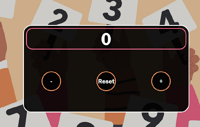

# Counter in JavaScript ⌚

A simple and dynamic counter in JS. 
## Assignment

Create a click counter with + and - buttons in JS. 
## How to

* Press '↓' on keyboard to decrement the counter.
* Press '↑' on keyboard to increment the counter.
* Press 'Delete' on keyboard to reset the counter to 0.

* Click '+' button to increment the counter.
* Click '-' button to decrement the counter.
* Click 'Reset' button to reset the counter to 0.
## Preview 

## Deployment

Deployed on Netlify.
[Check it out!](https://giuliacounterjs.netlify.app/)
